<div align="center">

# Flutters

### A cinema website in native PHP

Browse films, pick a showtime, pay with Stripe and get a PDF ticket with a QR code. Behind the scenes, a back-office runs films, showtimes, events, users and newsletters, without a single framework.

[](#-under-the-hood)
[](#-under-the-hood)
[](#-under-the-hood)
[](#-under-the-hood)
[](#-book-pay-get-your-ticket)
[](#-under-the-hood)

[Tour](#-a-quick-tour) · [The films](#-whats-on) · [Booking](#-book-pay-get-your-ticket) · [Events](#-special-nights) · [Accounts](#-your-account) · [Back-office](#-the-back-office) · [Under the hood](#-under-the-hood) · [Run it](#-run-it-locally) · [Team](#-team)

</div>

<p align="center">
  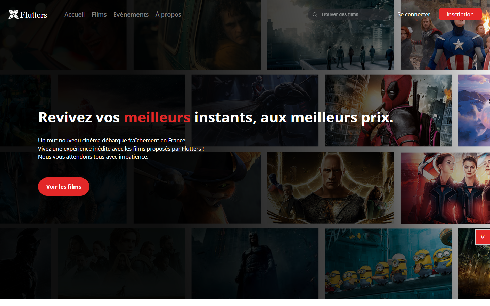
</p>

---

## 🎬 A fictitious cinema, a real website

**Flutters** is our first dynamic website, built as the 1st-year annual project at ESGI Paris (spring 2023). The rule was **native PHP, no framework**: Bootstrap for the CSS, plus a few utility libraries for e-mail (PHPMailer), payment (Stripe) and PDF generation (wkhtmltopdf).

Three students put about **425 hours** into it, from the Figma mock-ups and the data model to deployment on our own **OVH server** (Apache, MariaDB, HTTPS). The result has about **12,700 lines of PHP**, a 20-table database, **51 films, 289 showtimes and 6 events**, and every flow a real cinema needs, from the first visit to the ticket scanned at the door.

---

## 🎞 A quick tour

<p align="center">
  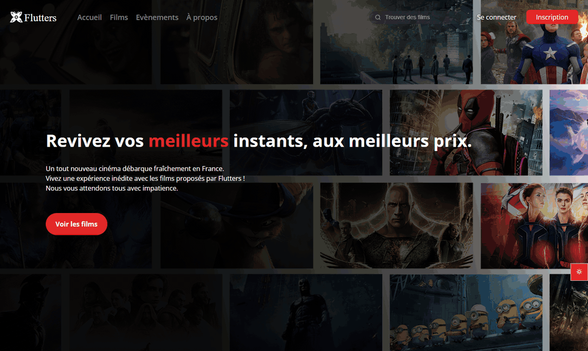
  <br /><sub><em>Home → films → Avatar → pick a showtime → choose the number of tickets</em></sub>
</p>

---

## 🍿 What's on

The **films page** splits the catalogue into films with upcoming showtimes and the rest. Its search box is powered by `fetch`: the same PHP partial renders the list on first load and is fetched again by JavaScript as you type, so there's no duplicated template.

Each **film page** shows the poster, synopsis, genres, cast, directors, average rating and trailer. Below it, a **showtime calendar** lets you move day by day or jump to any date with a date picker. Past showtimes are greyed out.

<table width="100%">
  <tr>
    <td width="50%">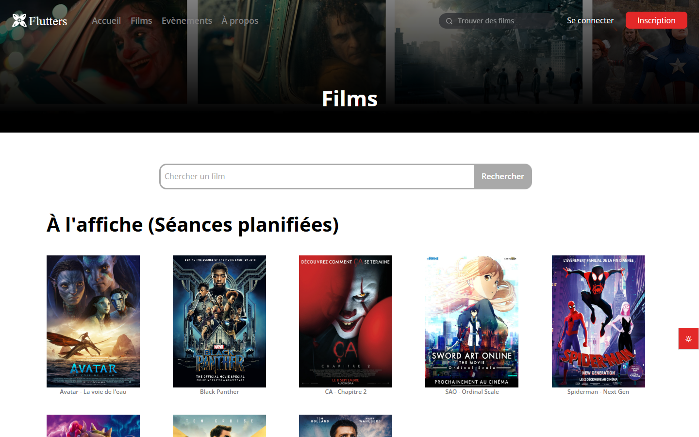</td>
    <td width="50%">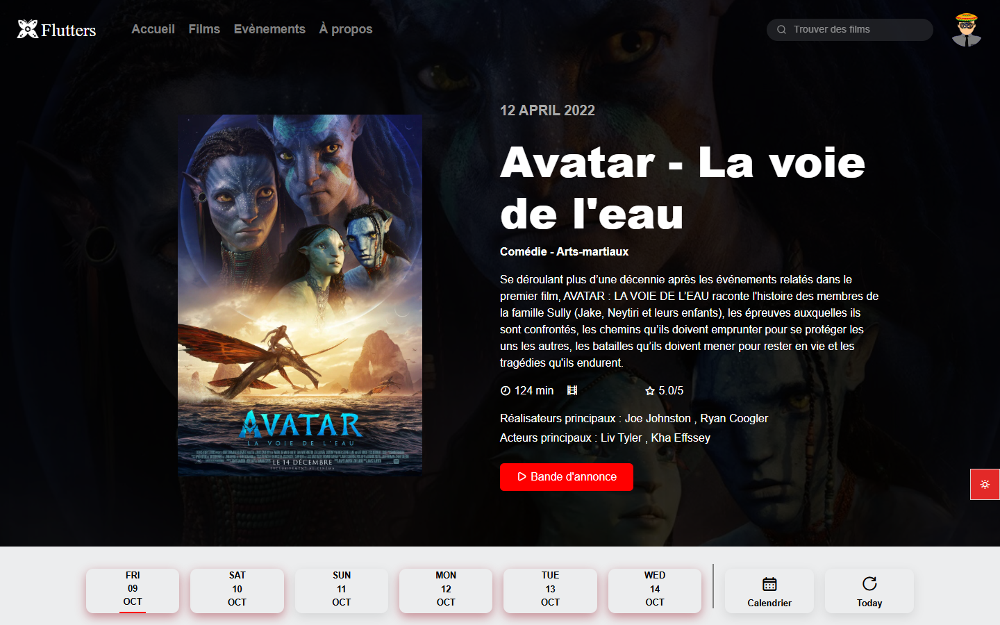</td>
  </tr>
  <tr>
    <td align="center"><sub><em>The catalogue, with live search</em></sub></td>
    <td align="center"><sub><em>A film page: details, then the showtime calendar</em></sub></td>
  </tr>
</table>

Logged-in users can leave **one review per film** (1 to 5 stars) and edit it later; all reviews load via `fetch`. The **home page** features the five best-rated films, a carousel of upcoming events and each founder's favourite film.

---

## 🎟 Book, pay, get your ticket

1. **Pick a showtime.** The booking page shows the room, the language (VO / VOSTFR), the end time and the **seats left**, which is the room's capacity minus the tickets already sold.
2. **Choose your tickets** (up to 8) and see the total update live.
3. **Pay with Stripe Checkout.** A **signed webhook** confirms the payment, then the site creates the order and **one ticket per seat**, and sends a confirmation e-mail.
4. **Download your PDF ticket** (generated with wkhtmltopdf), with a **QR code** on it.
5. **At the door**, staff scan the QR code. It opens a check-in page where a staff code validates the order. Each ticket can be used **once**: scanning it again shows "already validated".

<table width="100%">
  <tr>
    <td width="50%">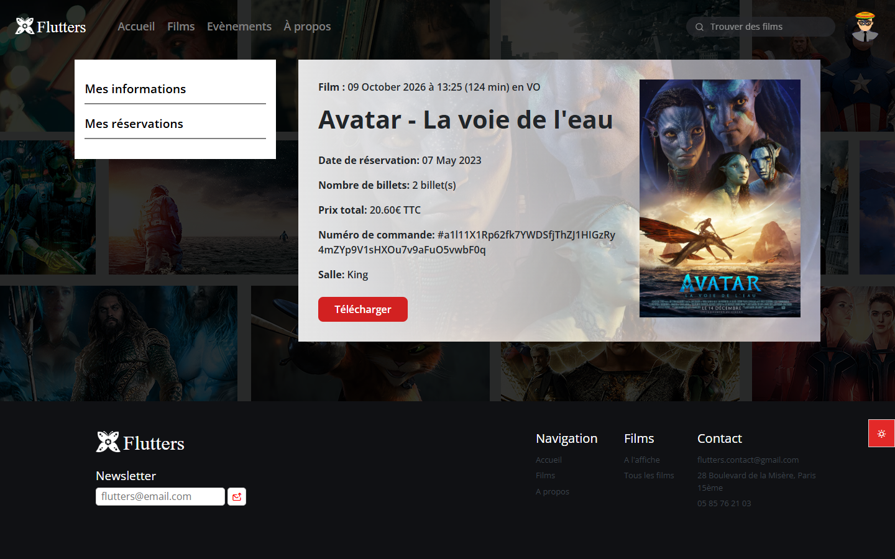</td>
    <td width="50%">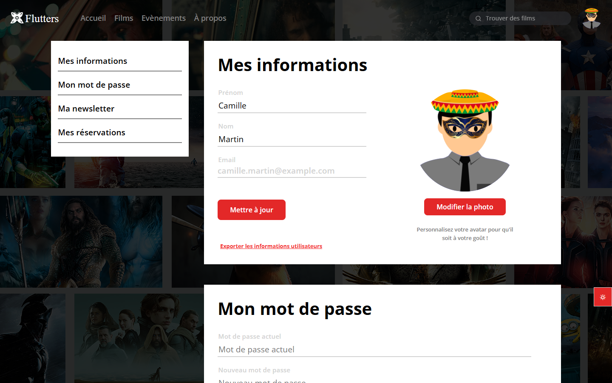</td>
  </tr>
  <tr>
    <td align="center"><sub><em>"My bookings": films and events together, with the PDF ticket</em></sub></td>
    <td align="center"><sub><em>The profile, with a layered avatar builder</em></sub></td>
  </tr>
</table>

---

## 🎉 Special nights

The cinema also runs **events**, such as a Pokémon marathon or a Star Wars night. They have their own listing (upcoming and past, with search), their own page with capacity and price, and the same flow: Stripe payment, PDF ticket, QR check-in.

<table width="100%">
  <tr>
    <td width="50%">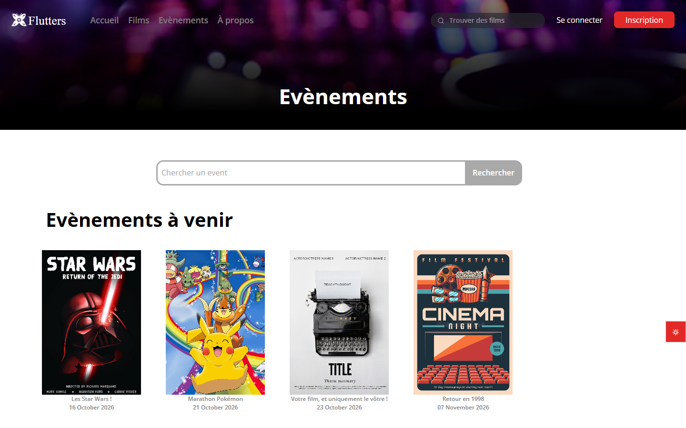</td>
    <td width="50%">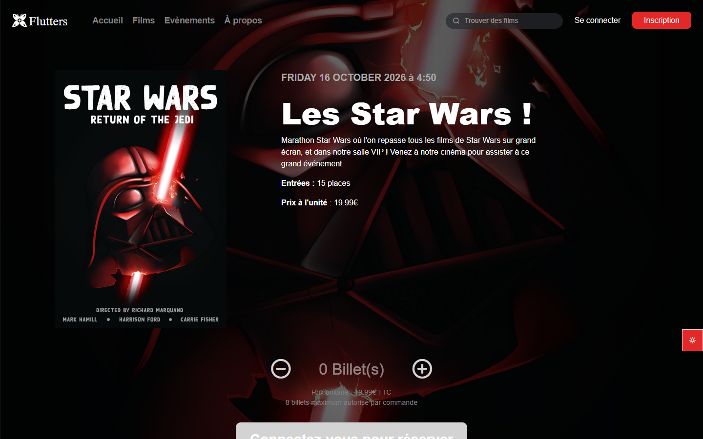</td>
  </tr>
</table>

---

## 👤 Your account

- **Sign-up** checks every field on the server (names, e-mail format, a password with upper case, lower case and a digit) and sends a **verification e-mail**. You can't log in until you click the link.
- **A home-made captcha.** Instead of a third-party service, we built a **3×3 swap puzzle**: 24 image sets, shuffled at random, and you swap tiles until the picture is complete.

<table width="100%">
  <tr>
    <td width="38%" align="center"></td>
    <td width="62%" align="center">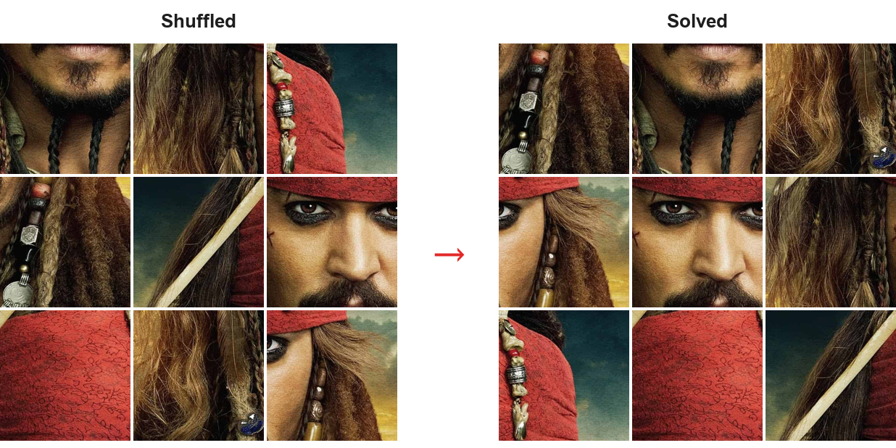</td>
  </tr>
</table>

- **Forgot password**, with a reset link by e-mail.
- **Profile:** edit your name, build your **avatar** from 16 parts (head, eyes, mouth, outfit), change your password, subscribe to the newsletter, and **export all your data as a PDF**: profile, orders and activity log, GDPR-style.
- **"We miss you" e-mails** go automatically to users who haven't logged in for 30 days, with an opt-out link.
- **Light and dark mode**, remembered in a cookie, plus a cookie-consent pop-up and real legal pages (GDPR, terms, legal notice).

<p align="center">
  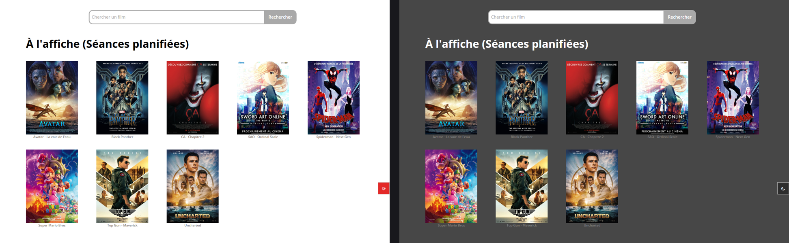
</p>

---

## 🛠 The back-office

Admins get a dashboard with **nine sections**. Each one has a live `fetch` search and create / edit / delete modals:

- **Films:** poster upload with preview, and a dynamic multi-select for genres, actors and directors.
- **Showtimes:** with a **room clash check** that refuses a showtime overlapping another one in the same room.
- **Events:** with poster upload.
- **Users:** create admins, change roles, and **ban or unban** accounts.
- **Genres, actors, directors.**
- **Newsletter:** subscriber list, and **mass mailing** with a subject, a body, an image and an unsubscribe link in every e-mail.
- **Logs:** every action on the site (logins, sign-ups, payments, PDF downloads, reviews…) is written to a daily log and a per-user log. Admins browse them by date.

<p align="center">
  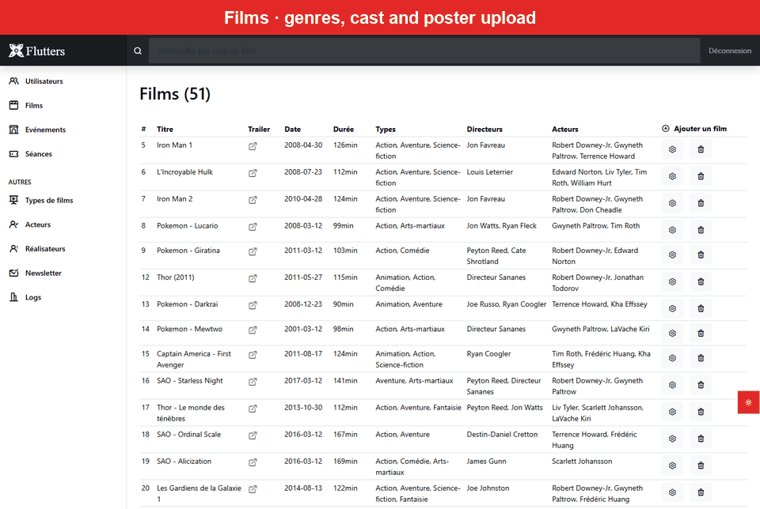
</p>

---

## 🧱 Under the hood

| Layer | Choice |
|---|---|
| **Back end** | Native PHP 7.4: page scripts, `include` partials, and small `api/*.php` endpoints that return HTML fragments |
| **Database** | MariaDB through PDO: 20 tables (films, cast, rooms, showtimes, events, orders, tickets, payments, reviews, avatar parts…) |
| **Front end** | Vanilla JavaScript and `fetch` (27 calls), Bootstrap 5.3, custom CSS with 49 media queries and a burger menu on mobile |
| **E-mail** | PHPMailer over SMTP: verification, password reset, order confirmation, newsletters, inactivity reminders |
| **Payment** | Stripe Checkout (test mode) and signed webhooks |
| **PDF & QR** | wkhtmltopdf for tickets and data exports, QR codes on every ticket |
| **Hosting** | Our own OVH server: Apache with clean URLs (`.htaccess` rewrite), MariaDB, HTTPS, custom 403/404/500 pages |

<p align="center">
  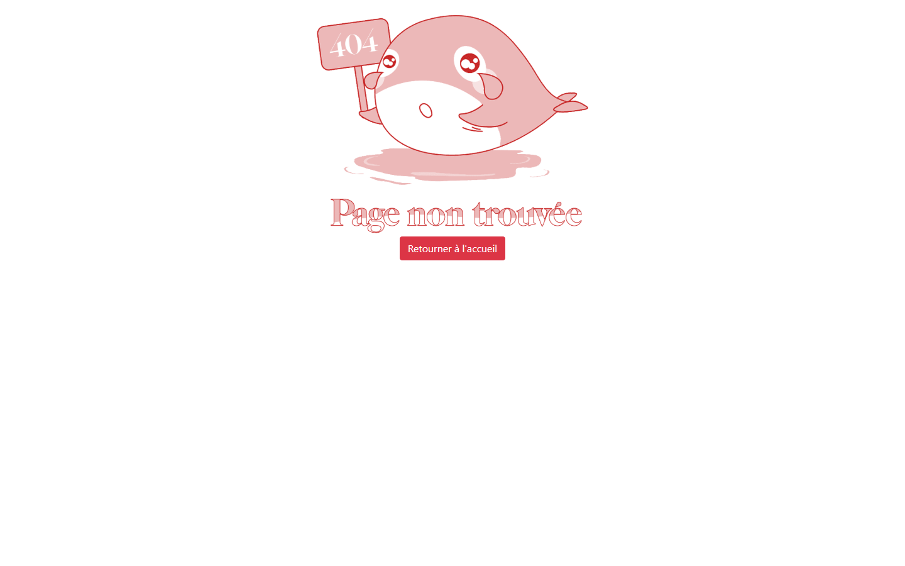
</p>

---

## 🚀 Run it locally

The site was written for its production server: it includes files from `/var/www/flutters.ovh`, expects to be served at the web root, and links to `https://flutters.ovh` about a hundred times. This is how we got it running again with Docker (the screenshots and GIFs above come from that setup):

1. **Point the links at your machine.** In a copy of the repo, replace every `https://flutters.ovh` (and `www.` / `Flutters.ovh` variants) with `http://localhost:8088`.
2. **Database: MySQL 8** with a database named exactly `Flutters` and the user from `pages/connect_db.php`. Import the dump with foreign-key checks off, then add the table the code expects but the dump lacks, and relax MySQL 8's `GROUP BY` rule:

```sql
SET FOREIGN_KEY_CHECKS=0;
SOURCE flutters_bdd.sql;
SOURCE flutters_bdd_content.sql;
SET FOREIGN_KEY_CHECKS=1;
CREATE VIEW IN_LANGUAGE AS SELECT id_movie, id_language FROM MOVIE;
SET PERSIST sql_mode = 'STRICT_TRANS_TABLES,NO_ZERO_IN_DATE,NO_ZERO_DATE,ERROR_FOR_DIVISION_BY_ZERO,NO_ENGINE_SUBSTITUTION';
```

3. **Web server: `php:7.4-apache`.** The code uses PHP 7 behaviour and crashes on PHP 8. Mount the copy at `/var/www/flutters.ovh`, use it as the document root, enable `mod_rewrite` with `AllowOverride All`, and install `pdo_mysql`. The code connects to `localhost`, so PHP must reach MySQL through its Unix socket: share `/var/run/mysqld` between the two containers and set `pdo_mysql.default_socket`.
4. **Showtimes** in the seed end in 2023. Shift `SESSION.seance_date` and `EVENT.date_event` forward to see a schedule.

E-mails, Stripe payments and PDF tickets also need your own SMTP account, Stripe test keys and the `wkhtmltopdf` binary. Replace the values written in the code before trying them.

---

## 🧾 Honest tech debt

This was our first web project, and we'd do a lot of things differently today:

- **Security.** Passwords are hashed with unsalted SHA-512 instead of `password_hash`. Many queries are built by string concatenation instead of prepared statements. Most back-office endpoints don't check the admin session, and nothing is protected against CSRF. The captcha and the 8-ticket limit are only checked in the browser.
- **Configuration in the code.** The database, SMTP and Stripe credentials are written directly in the PHP files instead of an environment file, and the production domain is hard-coded in about a hundred places.
- **Data in the repo.** The `logs/` folder and the seed data contain real activity logs and user records from the time the site was live.
- **Duplication.** There are seven copies of PHPMailer, two identical `vendor/` folders, and the film and event booking flows are copy-pasted versions of each other.
- **Schema drift.** The SQL dump is missing a table the code uses (`IN_LANGUAGE`) and needs foreign-key checks disabled to import.
- **No tests, no CI and no `.gitignore`**, and the commit history doesn't reflect who did what (see below).

---

## 👥 Team

| Contributor | Main contributions |
|---|---|
| **Frédéric Huang** · [@Huang-Frederic](https://github.com/Huang-Frederic) | Sign-up with e-mail verification, home-made captcha, login and password reset; film page (showtime calendar, sessions, reviews); films list and search; booking, Stripe Checkout and webhooks, order recap with PDF ticket, e-mail and QR check-in; profile, data export and bookings; newsletter sending and automatic e-mails; light/dark mode, cookie pop-up, navbar and footer; activity logging; responsive design |
| **Franck Zhuang** · [@franckzhuang](https://github.com/franckzhuang) | Figma mock-ups, data model, OVH server setup and deployment; the whole back-office (users with ban, films, cast, genres, events, showtimes with clash check, logs); avatar builder; events pages and event booking; error pages |
| **Jonathan Todorov** | Figma mock-ups, home page (carousel, cards, FAQ), About page, newsletter subscribers dashboard |

The work was split by features (about 160 h, 164 h and 101 h). Almost every commit was pushed from a single account, so the git history doesn't show who wrote what.

---

## 📄 License

This is an academic project. The cinema is fictional, and film posters and images belong to their respective owners. The source code is shared for portfolio and learning purposes only, and no license is granted for commercial use or redistribution.

---

<div align="center">

Built in spring 2023 by three first-year students, before we knew what a framework was.

</div>
